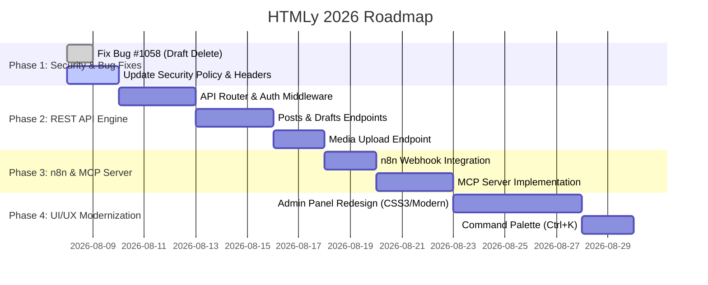

# Development Roadmap & Implementation Plan (DEVPLAN)

Dokumen ini berisi tahapan eksekusi dan roadmap pengembangan **HTMLy 2026 Modernization & AI Integration**.

---

## 🗺️ Roadmap & Phases

---

## 📋 Actionable Tasks

### Phase 1: Security & Core Stabilization
- [x] Fix Bug #1058: Mencegah draft stale menghapus post published.
- [ ] Perbarui `SECURITY.md` dengan standar OWASP 2026 & kebijakan penanganan kerentanan.
- [ ] Terapkan Security Response Headers (CSP, HSTS, X-Content-Type-Options) di `.htaccess` dan `system/htmly.php`.

### Phase 2: REST API Core (`system/api/v1/`)
- [ ] Buat `system/api/v1/router.php` untuk menangani endpoint API terpisah dari HTML view router.
- [ ] Implementasikan `system/api/v1/auth.php` (Bearer token validation via `config/api_keys.ini`).
- [ ] Implementasikan CRUD Controller untuk `/api/v1/posts` dan `/api/v1/drafts`.
- [ ] Implementasikan file upload handler di `/api/v1/media/upload`.

### Phase 3: Automation & Agentic MCP Integration
- [ ] Tambahkan webhook event dispatcher saat post dipublish/dihapus (`system/core/Webhook.php`).
- [ ] Buat package MCP Server (`mcp-server/index.js` atau CLI wrapper) yang membungkus REST API ke format MCP JSON-RPC.

### Phase 4: Modern Admin UI & Themes
- [ ] Refactor CSS admin di `system/admin/resources/` menggunakan Vanilla CSS Variables (Dark/Light mode).
- [ ] Implementasikan komponen Command Palette (`Ctrl+K`) menggunakan Javascript murni tanpa framework berat.
